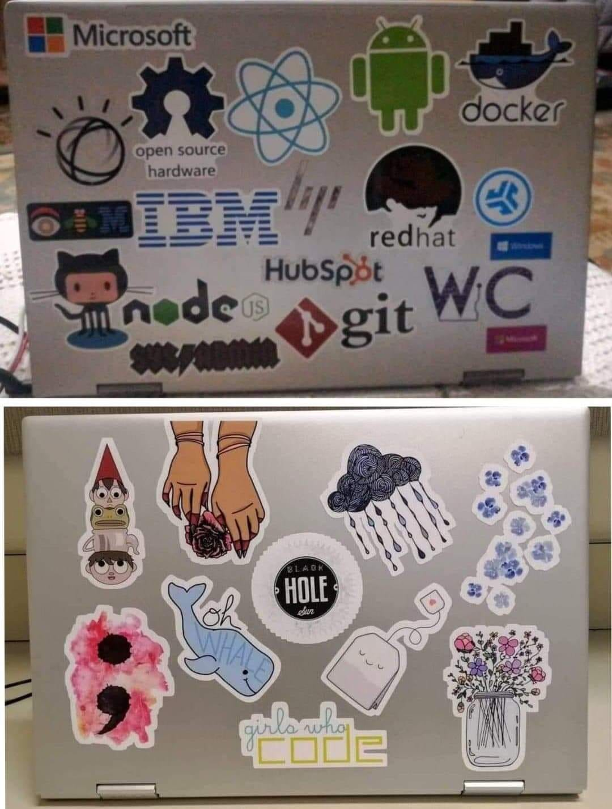

### Hi!

Allowing my achievements - academic or otherwise - to speak for my prowess is quite uncomfortable, but it is the only heuristically efficient metric to hand someone who has no other data. I am an Honors scholar at my university, which is to say that I am in the top 1% of students in terms of academics and extracurricular activities. To continue to be a part of this program, I have to take advanced classes, wipe off a mixture of tears and sweat off of myself to maintain a high GPA and display intense community involvement. I take relentless interest in reading and writing, both prose and poetry; I am a features writer for the Reporter, my college’s monthly magazine. Besides that, you can find my writing sprinkled around the virtual realm. [Here's](https://medium.com/@priontidipitanasir) one of the places I speak of.

